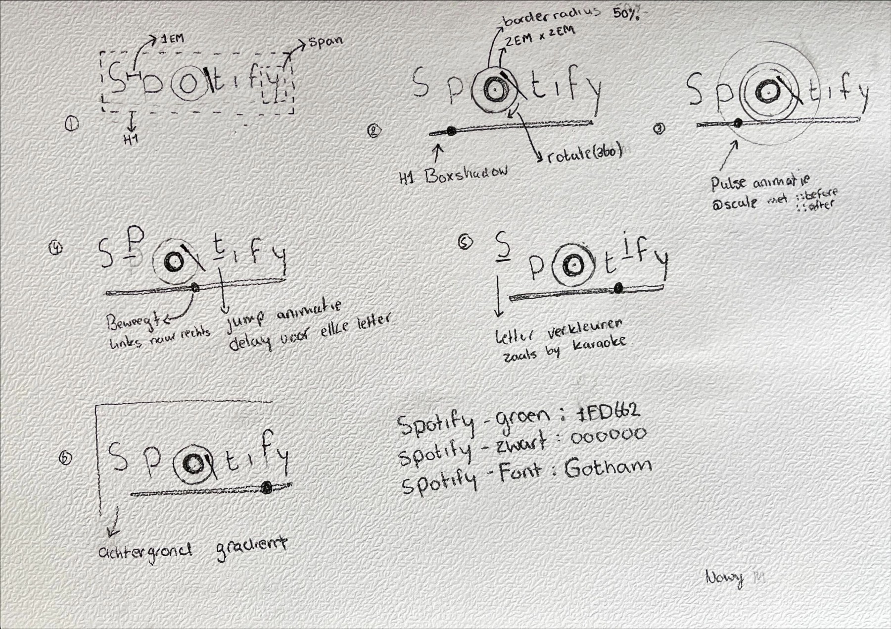
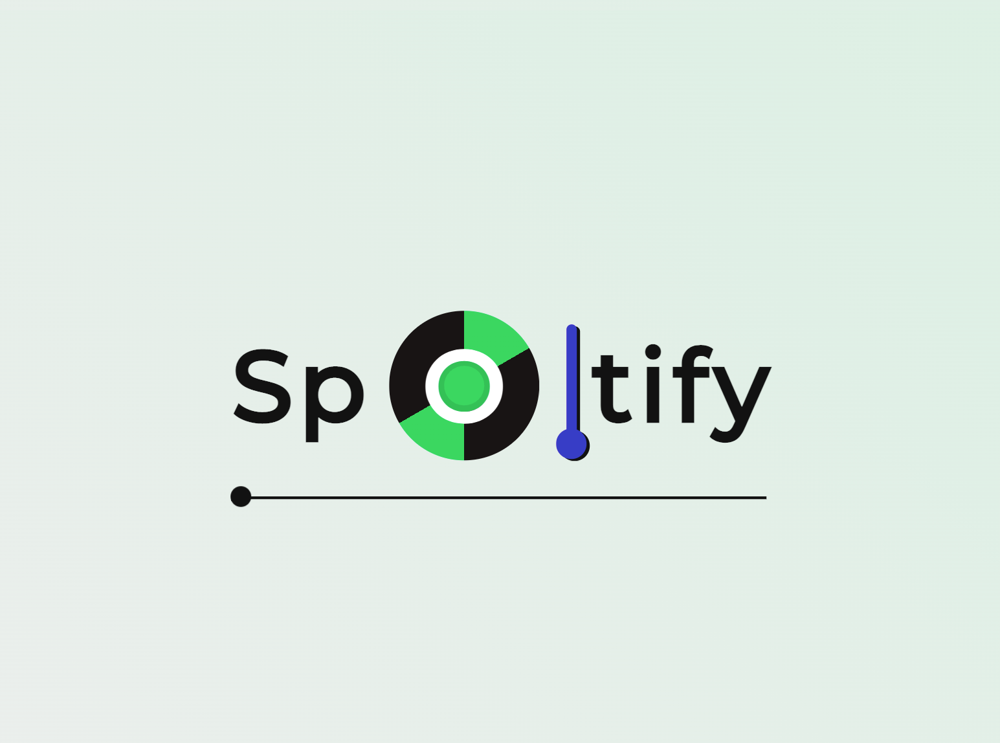
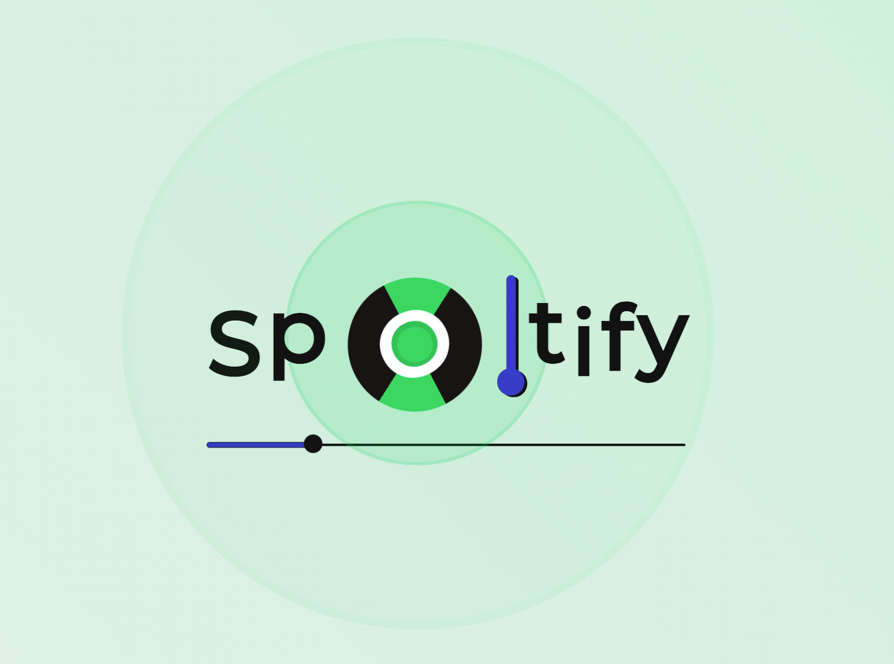
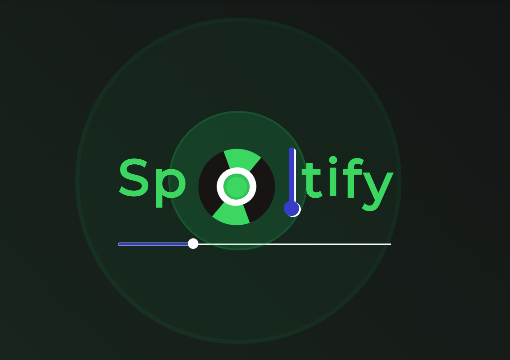
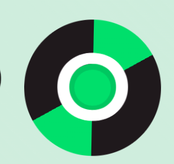
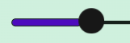
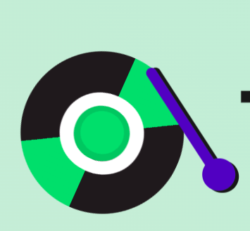

# Procesverslag :page_facing_up:
**Auteur:** Nowy Meepho :heart_eyes_cat:

**De opdrachten:** [opdracht 1](opdracht1/index.html) en [opdracht 2](opdracht2/index.html)


Markdown is een simpele manier om HTML te schrijven.  
Markdown cheat cheet: [Hulp bij het schrijven van Markdown](https://github.com/adam-p/markdown-here/wiki/Markdown-Cheatsheet).

Nb. De standaardstructuur en de spartaanse opmaak van de README.md zijn helemaal prima. Het gaat om de inhoud van je procesverslag. Besteedt de tijd voor pracht en praal aan je website.

Nb. Door *open* toe te voegen aan een *details* element kun je deze standaard open zetten. Fijn om dat steeds voor de relevante stuk(ken) te doen.

## Table of Content

* 🗒️ [Opdarcht1 plan](#plan1)
* 🔄 [Opdarcht1 reflectie](#reflectie1)
* 🗒️ [Opdracht2 plan](#plan2)
* 🧪 [Opdracht2 test](#test2)
* 🔄 [Opdracht2 reflectie](#reflectie2)

## Bronnenlijst :books:
  1. -[Devolper mozilla](https://developer.mozilla.org/en-US/docs/Web/CSS)-
  2. -[Spotify design guide](https://developer.spotify.com/documentation/general/design-and-branding/)-
  3. -[Google fonts](https://fonts.google.com/?query=montserrat)-
  4. -[Spotify afbeelding](https://commons.wikimedia.org/wiki/File:Spotify_logo_without_text.svg)-
  5. -[JS library drag and drop](https://listjs.com/overview/download/)
  6. -[Keyboard Event](https://developer.mozilla.org/en-US/docs/Web/API/KeyboardEvent/code)
  7. -[Shadow-box](https://getcssscan.com/css-box-shadow-examples)
  8. -[Border radius](https://9elements.github.io/fancy-border-radius/#65.81.80.23--542.542)
  9. -[Codepen Sanne](https://codepen.io/shooft)
  10. -[ANCH API](http://acnhapi.com/)
  11. -[Flip card](https://www.smashingmagazine.com/2020/02/magic-flip-cards-common-sizing-problem/)


<a name="plan1"/>

## Opdracht 1 plan :memo:

<details open>
  <summary>uitwerken na schetsen idee (voor week 2)</summary>


  ### Je storyboard:
  


  ### Je ambitie: 
  Aan deze technieken/punten wil ik werken:
  - Pseudo elementen ::before & ::after
  - Keyframes & animatie
  - CSS custom properties
  - Werken met gradient
 
</details>

<a name="reflectie1"/>

## Opdracht 1 reflectie :repeat:

<details>
  <summary>uitwerken bij afronden opdracht (voor week 4)</summary>


  ### :checkered_flag: Je uitkomst - karakteristiek screenshot(s):
  
  
  

  ### :sunglasses: Dit ging goed/Heb ik geleerd: 
  Werken met pseudo elementen zoals ::before & ::after gingen goed, ik heb veel geleerd hoe je dat kan gebruiker en animeren.
  Daarnaast vond ik gradient ook interresant om verschillende patronen te maken. 

  
   

  ### :weary: Dit was lastig/Is niet gelukt:
  Ik heb de parent geanimeerd alleen de pseudo elementen gaan ook animeren alleen dat wil ik niet. Ik heb geprobeerd met een tegenovergestelde animatie   proberen te cancellen maar dat is deels gelukt. omdat ik twee animatie hebt bij de pseudo elementen werkt mijn tweede animatie niet. 
  
  Daarnaast had ik ook geëxperimenteerd met underline wavy, dat werkt wel alleen voor mijn opdracht is dat moeilijk/niet mogelijk.

  
</details>

<a name="plan2"/>

## Opdracht 2 plan

<details>
  <summary>uitwerken na schetsen idee (voor week 5)</summary>


  ### Je ontwerp:
  ### desktop:
  
  
  
   

### mobile:
   
  
   
  
  
  
  ### Je ambitie: 
  Aan deze technieken/punten wil ik werken:
  - Werken met public API
  - Geavanceerd animaties 
  - Op verschillende manieren bedienen zoals drag & drop
  - Intersection Observer werken
  
</details>


<a name="test2"/>

## Opdracht 2 test

<details>
  <summary>uitwerken na testen (week 7)</summary>

  


  ### Bevinding 1:
  * Cards kunnen niet omdraaien wanneer je erop klikt.

  #### oplossing:
  Ik heb met hulp de eventlisterner in mijn API foreach gezet zodat hij het kan zien. Dit komt omdat JS al laad voordat de API data worden in geladen waardoor het niet werkte.
  ```
  const buttonSlide = list.querySelector('li:last-of-type');
  
  buttonSlide.addEventListener('click', draaiPhoenixOm);
  ```


  ### Bevinding 2:
  * Scrollen door de cards lijstjes. 

  #### oplossing:
  Scrollen door de lijstjes lukte alleen je scrolt de pagina maar dat ik wil dus niet ik wil dat je door een lijstje scrolt zonder dat je de pagina scrolt. Dit heb ik opgelost door overflow: hidden en overflow-y: scroll.


 ### Bevinding 3:
  * Intersection observer.

  #### oplossing:
  Intersection observer werkte eerst ook niet en dat kwam ook omdat hij het lijstje niet ziet. Ik heb dus hetzelfde opgelost als met de flipcard. Ik heb de hele functie in de API gezet. Dit vind ik trouwens heel lelijk om te doen maar omdat we niet een template engine werken, weet ik niet zo goed hoe het anders moet.
  
  ```
  const options = {
        root: null,
        threshold: 0.4,
        rootMargin: '0px',
      };

      const observer = new IntersectionObserver(function (entries, observer) {
        entries.forEach((entry) => {
          entry.target.classList.toggle('slide-top', entry.isIntersecting);
        });
      }, options);

      cards.forEach((card) => {
        observer.observe(card);
        card.classList.add('hide');
      });
    });
  ```
  
   ### Bevinding 4:
  * Ik kon geen data selecteren uit een API.

  #### oplossing:
  Ik moest data uit de API halen maar ik wist niet hoe je een data moet selecteren met een `-` erin zoals `file-name`. Ik heb eerst geprobeerd om de data te formateren in een array met `map()` maar dat ook geen succes. Ik heb uiteindelijk gewoon zitten experimenteren en daarna was het toch gelukt. Ik heb gelost door dit te typen:
  
  ```
   const img = aArt.image_uri;
   const artDesc = aArt['museum-desc'];
   const artPrice = aArt['buy-price'];
  ```

  ### Bevinding 5:
  * Card drag and drop ziet raar uit

  #### oplossing:
 Ik voor mijn feature dat je cards kan drag and drop op het scherm alleen dat werkt wel maar het ziet raar uit omdat mijn card bestaat uit een achterkant en voorkant. Wanneer ik een card sleep dan zie ik de achterkant. Ik weet niet hoe je dit moet oplossen. Ik heb dit als code:
  ```
  new Sortable(allesLijst, {
  group: 'shared', // set both lists to same group
  animation: 150,
});

new Sortable(favoLijst, {
  group: 'shared',
  animation: 150,
});

  ```

</details>


<a name="reflectie2"/>

## Opdracht 2 reflectie

<details>
  <summary>uitwerken bij afronden opdracht (voor week 8)</summary>

  ### Je uitkomst - karakteristiek screenshot(s):
  
  


  ### Dit ging goed/Heb ik geleerd: 
  Ik vond het best moeilijk voor sommige styling met grid etc. Het is gelukt om een card te weergeven met de info van de api en je kan flippen. Ik vond het zeer leerzaam om met verschillende technieken te werken met drag and drop en nog meer.

  


  
</details>
